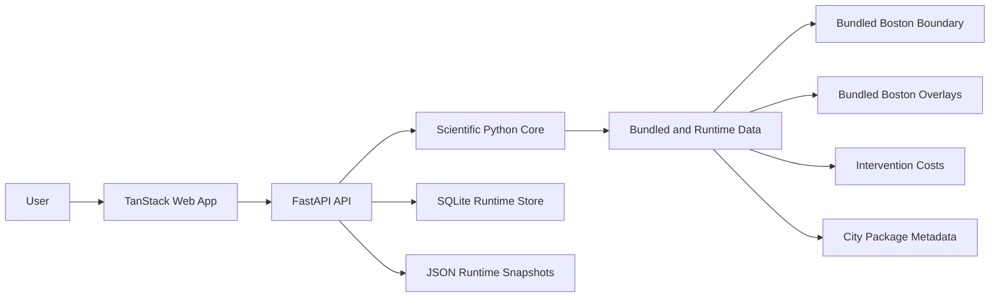
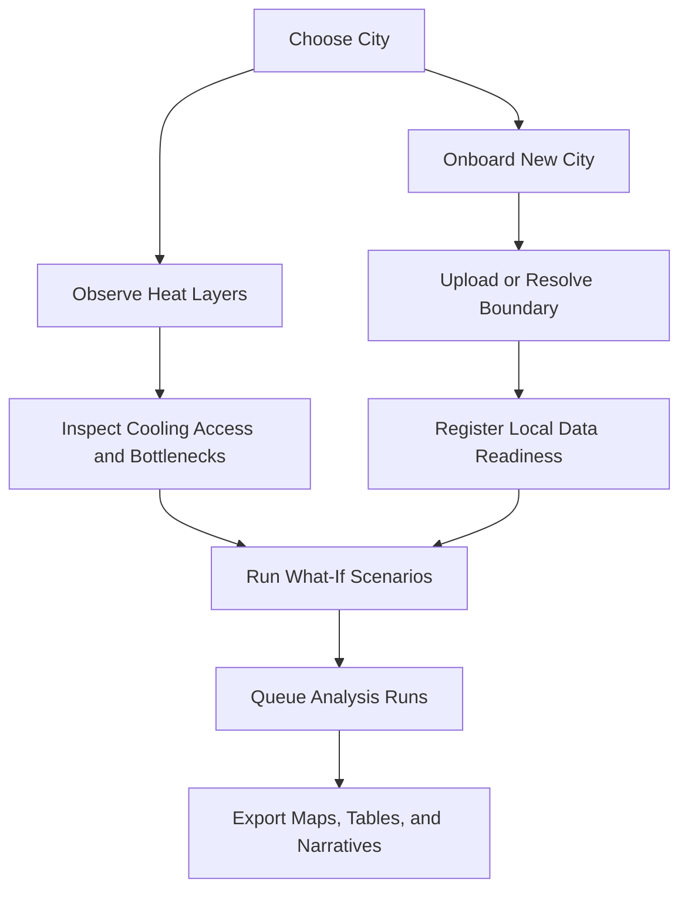

# Urban Heat Democratization

[](https://github.com/aartisr/urban-heat-democratization/actions/workflows/ci.yml)


Urban heat is one of the most unequal climate risks in modern cities.
This repository turns that reality into a system people can see, question,
model, and act on.

`urban_heat_democratization` is a city-agnostic urban heat planning platform
with three jobs:

1. explain where heat is trapped,
2. show why cooling access breaks down,
3. help users compare mitigation strategies with scientific and operational
   discipline.

It is designed to be serious enough for researchers, useful enough for city
teams, and clear enough for educators, students, and community advocates.

## Platform snapshot

| Dimension | Current strength |
| --- | --- |
| Mission | Translate urban heat science into planning and public action |
| Product shape | Interactive atlas, scenario workbench, exports, and run tracking |
| Scientific core | Graph, spectral, resistance, reliability, and raster workflows in Python |
| Operational model | Local-first API, SQLite runtime queue, JSON mirrors, CI-backed validation |
| Best current experience | Boston bundled artifacts with upload-first expansion for new cities |

## Why it matters now

Heat is not distributed fairly.
Neither is the capacity to study it, explain it, or act on it.

This platform is built around a simple belief: the tools for understanding
urban heat should not be locked behind specialist workflows, unreadable
pipelines, or one-off consulting studies. They should be usable by the people
who have to teach, debate, fund, and implement heat mitigation in the real
world.

## Truth and evidence standard

This repository should be read with one governing rule:

`If a claim is not source-backed, bounded, and honestly labeled, it should not appear here as fact.`

In practice, that means:

- verified claims should point to public, inspectable, or reproducible sources
- benchmark claims should be labeled as benchmarks, not disguised as local truth
- proxy metrics should be labeled as proxies, not implied to be validated field outcomes
- partial features should stay described as partial until evidence says otherwise
- unknowns, caveats, and missing data should be stated near the claim, not buried later

This repo would rather be precisely honest than impressively vague.

## Why this project exists

Most heat tools stop at a heat map.
Most research pipelines stop at a paper.

This project aims for the missing middle: a platform that makes advanced urban
heat reasoning legible, reproducible, and actionable.

The ambition is not just to visualize heat.
The ambition is to help answer the questions real people ask:

- Where are the heat traps?
- Why are they trapped?
- Which corridors are structurally weak?
- Which interventions help most under a fixed budget?
- What changes when equity matters as much as aggregate cooling?
- What can a city, school, classroom, or community group actually do next?

## What makes it different

- `Research-grade core`: Python modules for graph analysis, spectral methods,
  reliability, percolation, raster handling, and report generation.
- `Decision-oriented UX`: a TanStack web app for maps, scenarios, city
  onboarding, exports, and run management.
- `Explainability-first design`: the system is built around interpretable
  layers, scenario comparison, provenance, and transparent tradeoffs.
- `City-agnostic architecture`: Boston is the primary bundled example, but the
  system is intentionally structured for onboarding additional cities.
- `Local-first execution`: runtime state is stored in SQLite and mirrored JSON,
  which keeps the platform easy to run, inspect, and extend.
- `Live-data bridge model`: the repo can build local bridge payloads for live
  Landsat and ECOSTRESS freshness metadata without hard-wiring the whole system
  to one provider stack.

## Current product reality

This repository is ambitious, but it is also explicit about what is real today.

- Boston is the only bundled city with local boundary and overlay artifacts in
  this repo.
- Two Boston package variants exist today:
  - `boston-research`
  - `boston-classroom`
- New York City, Chicago, Los Angeles, Houston, and custom geographies are
  onboarding presets, not fully bundled local-data cities.
- Scenario planning is benchmark-based today. It is useful for structured
  exploration, but it is not yet a validated city-specific optimization engine.
- Runtime state is local-first and stored in SQLite plus mirrored JSON files
  under `data/runtime/`.

That honesty is a feature, not a weakness. The repo is designed so the gap
between today's implementation and tomorrow's production platform is visible,
traceable, and bridgeable.

## Experience at a glance





## Architecture quick reference

| Layer | Responsibility | Primary location |
| --- | --- | --- |
| Experience | City browsing, map exploration, scenarios, exports, run views | `web/` |
| Service | API contracts, orchestration, runtime coordination, access rules | `api/` |
| Scientific core | Domain logic for graphs, spectra, reliability, reports, and rasters | `core/` |
| Bundled data | Study artifacts, package metadata, cost sources, static city assets | `data/` |
| Mutable runtime | Onboarded cities, queued runs, JSON mirrors, SQLite state | `data/runtime/` |

## Core capabilities

### Atlas and city exploration

- city catalog and city detail views
- interactive heat maps and overlay inspection
- desktop full-page map mode for focused spatial analysis
- bundled Boston study artifacts and upload-first city onboarding

### Scientific modeling

- graph-based thermal representation of urban space
- spectral bottleneck analysis
- cooling access and resistance-style metrics
- robustness and percolation analysis
- report-friendly metrics and summaries

### Scenario planning

- benchmark-based what-if analysis
- intervention tradeoff framing
- cost-aware planning workflows
- queue-backed run creation and state tracking

### Operational readiness

- local SQLite-backed runtime queue
- JSON mirrors for inspectable local state
- package validation scripts for bundled city artifacts
- CI for Python tests, web tests, frontend build, and Playwright smoke coverage

## Repository layout

- `web/`: React + Vite + TanStack frontend
- `api/`: FastAPI service and HTTP endpoints
- `core/`: shared scientific and domain logic
- `data/`: bundled artifacts, runtime state, and sources
- `docs/`: plans, blueprints, guides, and operational notes
- `scripts/`: environment, validation, and provider bridge utilities
- `tests/`: Python test suite

## Fast document map

- [Quick Reference](docs/QUICK_REFERENCE.md)
- [Production Blueprint](docs/PRODUCTION_BLUEPRINT.md)
- [Artifact Strategy](docs/ARTIFACT_STRATEGY.md)
- [Verified Cost Sources](docs/verified_cost_sources.md)
- [Screen Tour](docs/SCREEN_TOUR.md)
- [City Onboarding Recipes](docs/CITY_ONBOARDING_RECIPES.md)
- [Implementation Status](docs/IMPLEMENTATION_STATUS.md)
- [Live Thermal Setup](docs/LIVE_THERMAL_SETUP.md)
- [Live Provider Bridges](docs/LIVE_PROVIDER_BRIDGES.md)
- [Intervention Unit Costs](docs/INTERVENTION_UNIT_COSTS.md)

## Quickstart

### Requirements

- Python `3.11`
- Node.js `18+`

Python 3.11 matters here because the pinned geospatial and scientific stack is
validated for that interpreter.

### One-command environment setup

```bash
make setup
```

That flow will:

- check for `python3.11`
- install it with Homebrew on macOS when possible
- create `.venv`
- install Python dependencies
- install web dependencies

### Manual setup

```bash
python3.11 -m venv .venv
source .venv/bin/activate
pip install -r requirements.txt
npm --prefix web install
```

### Run the platform locally

Terminal 1:

```bash
make api
```

Terminal 2:

```bash
make web
```

Then open the Vite URL shown in the terminal and start with Boston.

### Build and test

```bash
make test
make build
```

Equivalent targeted commands:

```bash
make test-python
make test-web
cd web && npm run test:e2e
```

## First 10 minutes

If you want the shortest path to understanding the system:

1. run `make setup`
2. run `make api`
3. run `make web`
4. open Boston in the atlas
5. inspect map layers and use full-page map mode on desktop
6. try a scenario on the Scenarios page
7. visit Cities and onboard a new GeoJSON boundary
8. inspect the exported runtime state under `data/runtime/`

Recommended first API checks:

- `GET /api/health`
- `GET /api/v1/health`
- `GET /api/v1/cities`
- `GET /api/v1/bundled-packages`
- `GET /api/v1/artifacts`

## Running the major workflows

### API

Preferred:

```bash
make api
```

Fallback:

```bash
source .venv/bin/activate
PYTHONPATH=. uvicorn api.main:app --reload
```

### Frontend

```bash
make web
```

### Frontend production build

```bash
make build
```

### Bundled package validation

```bash
make validate-packages
```

### Live Landsat and ECOSTRESS bridge payloads

```bash
make live-landsat CITY=boston
make live-ecostress CITY=boston
```

These commands write local provider bridge payloads to `data/runtime/live_thermal/providers/`.

## City onboarding model

There are two supported onboarding paths today:

1. onboarding through the web UI
2. onboarding through `POST /api/v1/cities/onboard`

Supported onboarding styles in the UI:

- `demo`
- `upload`
- `catalog`

Practical interpretation today:

- `demo` is best for bundled or classroom-style exploration
- `upload` is best for bringing a new GeoJSON boundary into the runtime store
- `catalog` is best when the boundary already exists on disk and the backend can resolve it

After onboarding, the runtime city record is persisted locally, including in:

- `data/runtime/cities.json`
- `data/runtime/urban_heat_runtime.sqlite3`

## Access control and workspace behavior

The API supports workspace-scoped role checks for mutating actions.

Headers:

- `x-api-key`
- `x-workspace-id`

Demo keys:

- `demo-admin`
- `demo-editor`
- `demo-viewer`

Optional strict mode:

```bash
export UHD_ENFORCE_AUTH=true
```

## Quality bar

This repo now includes a stronger quality baseline than a typical research-code
prototype.

- Python tests run in CI
- bundled city packages are validated in CI
- frontend unit tests run in CI
- frontend production build runs in CI
- Playwright smoke coverage runs in CI

Just as important, the repo maintains a documentation quality bar:

- implementation claims should match what the code and tests actually do
- source-backed costs should stay distinguishable from benchmark or proxy values
- partial systems should remain marked partial in user-facing docs
- provenance and caveats should sit close to the result being described

The goal is not only to explore ideas, but to turn them into a dependable
system that can keep evolving without breaking its promises.

## Why contributors should care

This is the kind of repository where product design, scientific computing,
public-interest technology, geospatial analysis, and climate storytelling all
meet in one place.

If you work on it, you are not just polishing code paths. You are improving the
clarity, credibility, and usefulness of a tool that aims to help cities reason
better about one of the defining resilience problems of this century.

## Design philosophy

This platform is guided by a few non-negotiable principles:

- `Democratize, do not dumb down`
- `Explainability over opacity`
- `Actionability over novelty`
- `City-agnostic design over one-off hard-coding`
- `Scientific seriousness with public-facing clarity`

In other words: the best result is not a beautiful map.
The best result is a better decision.

## Relationship to sister repositories

This repository is the generic, modular successor to earlier work in:

- `spectral_urbanism_boston`
- `spectral-urbanism`

Those repositories remain valuable references for research and historical
implementation context. This repository is where the platform story becomes
modular, product-facing, and city-extensible.

## Where this is headed

The long-term vision is a platform that can support:

- reproducible city onboarding at scale
- richer uncertainty and fairness analysis
- stronger scenario optimization
- more robust live data integration
- higher-fidelity exports for planning, education, and public communication

The repo already contains the bones of that future: a serious scientific core,
an interactive application layer, a growing operational playbook, and a clear
architecture for scaling beyond a single city.

## Summary

If you want a one-line description, it is this:

`urban_heat_democratization` is a research-informed, action-oriented urban heat
intelligence platform that helps people move from heat observation to heat
understanding to heat mitigation planning.
