# Urban Heat Democratization

TanStack-first urban heat planning app with a Python API and scientific core.

This repository is the generic, modular successor to the Boston-specific research work in `spectral_urbanism_boston` and the earlier `spectral-urbanism` codebase. Today it supports:

- a TanStack web app in `web/`
- a FastAPI backend in `api/`
- shared Python logic in `core/`
- runtime persistence in `data/runtime/`
- bundled Boston study artifacts plus upload-first onboarding for other cities
- async live-thermal adapter support with bridgeable Landsat and ECOSTRESS freshness metadata
- a simplified top-level workflow centered on overview, cities, modes, scenarios, exports, and runs

## Current reality

What is real today:

- Boston is the only bundled city with local boundary and spectral overlay artifacts in this repo.
- Two bundled Boston package variants exist:
  - `boston-research`
  - `boston-classroom`
- New York City, Chicago, Los Angeles, Houston, and custom cities are upload-first presets, not bundled local-data cities.
- Scenario planning is benchmark-based, not yet a validated city-specific optimizer.
- Runtime state is stored locally in SQLite and mirrored JSON files under `data/runtime/`.

## Repo layout

- `web/`
  React + Vite + TanStack Router/Query/Table frontend.
- `api/`
  FastAPI app and HTTP endpoints.
- `core/`
  Shared Python logic for cities, maps, package contracts, strategies, spectra, reliability, and percolation.
- `data/`
  Bundled artifacts such as Boston boundary and overlay GeoJSON files, intervention catalog, and cost sources.
- `docs/`
  Study guides, the living implementation log, and planning documents.
- `scripts/`
  Utility scripts, including bundled package validation.

## Fast document map

- [Quick Reference](/Users/rraviku2/aarti/urban_heat_democratization/docs/QUICK_REFERENCE.md)
- [Production Blueprint](/Users/rraviku2/aarti/urban_heat_democratization/docs/PRODUCTION_BLUEPRINT.md)
- [Artifact Strategy](/Users/rraviku2/aarti/urban_heat_democratization/docs/ARTIFACT_STRATEGY.md)
- [Screen Tour](/Users/rraviku2/aarti/urban_heat_democratization/docs/SCREEN_TOUR.md)
- [City Onboarding Recipes](/Users/rraviku2/aarti/urban_heat_democratization/docs/CITY_ONBOARDING_RECIPES.md)
- [Implementation Status](/Users/rraviku2/aarti/urban_heat_democratization/docs/IMPLEMENTATION_STATUS.md)
- [Live Thermal Setup](/Users/rraviku2/aarti/urban_heat_democratization/docs/LIVE_THERMAL_SETUP.md)
- [Live Provider Bridges](/Users/rraviku2/aarti/urban_heat_democratization/docs/LIVE_PROVIDER_BRIDGES.md)
- [Intervention Unit Costs](/Users/rraviku2/aarti/urban_heat_democratization/docs/INTERVENTION_UNIT_COSTS.md)

## Architecture at a glance

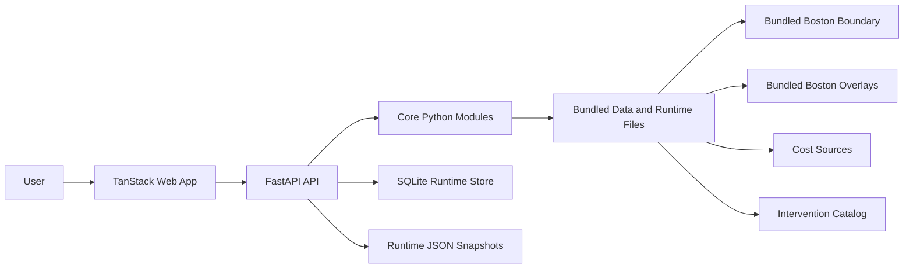

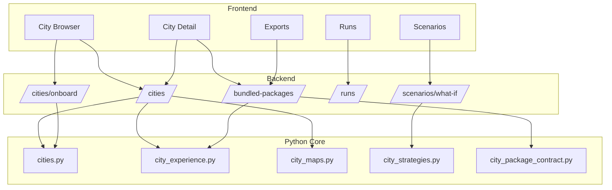

## User journey in one picture

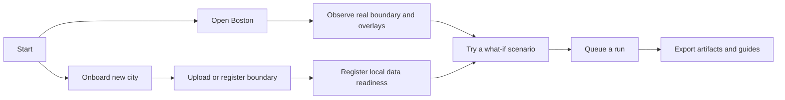

## Requirements

- Python 3.11 required for the pinned scientific stack
- Node.js 18+ recommended

Python dependencies are listed in [requirements.txt](/Users/rraviku2/aarti/urban_heat_democratization/requirements.txt).

Important:

- This repo is currently pinned for Python 3.11.
- Do not use the system `python3` blindly unless it is actually Python 3.11.
- Using Python 3.9 or a much newer interpreter can cause SciPy to fall back to a source build and fail with Cython/Meson errors.
- `make setup` now attempts to install `python3.11` with Homebrew on macOS if it is missing.

## Setup

### Python

From the repo root:

```bash
cd /Users/rraviku2/aarti/urban_heat_democratization
python3.11 -m venv .venv
source .venv/bin/activate
pip install -r requirements.txt
```

If you want a repo-provided bootstrap path:

```bash
cd /Users/rraviku2/aarti/urban_heat_democratization
bash scripts/bootstrap_env.sh
```

If you want the `Makefile` to handle Python setup too:

```bash
cd /Users/rraviku2/aarti/urban_heat_democratization
make setup
```

When `python3.11` is missing and Homebrew is available on macOS, the setup flow will install `python@3.11` before creating `.venv`.

If you want a fast compatibility check before creating the environment:

```bash
cd /Users/rraviku2/aarti/urban_heat_democratization
python3 scripts/check_python_env.py
```

### Web

```bash
cd /Users/rraviku2/aarti/urban_heat_democratization/web
npm install
```

## Developer workflow

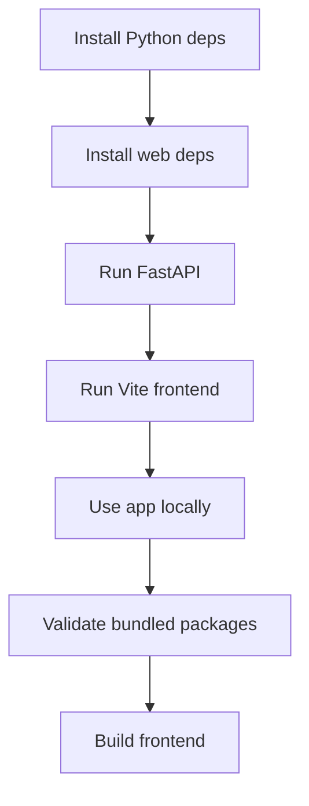

Typical daily workflow:

1. Activate the Python virtual environment.
2. Start the FastAPI server.
3. Start the Vite frontend.
4. Make code changes in `web/`, `api/`, or `core/`.
5. Validate bundled packages if you changed package metadata or artifacts.
6. Build the frontend before calling the work complete.

## How to run the app

You usually run the API and the web app in two terminals.

### 1. Run the Python API

Preferred:

```bash
cd /Users/rraviku2/aarti/urban_heat_democratization
make api
```

Raw fallback:

From the repo root:

```bash
cd /Users/rraviku2/aarti/urban_heat_democratization
source .venv/bin/activate
PYTHONPATH=. uvicorn api.main:app --reload
```

This starts the FastAPI server, typically at `http://127.0.0.1:8000`.

Useful health checks:

- `GET /api/health`
- `GET /api/v1/health`

### 2. Run the TanStack frontend

In a second terminal:

```bash
cd /Users/rraviku2/aarti/urban_heat_democratization/web
npm run dev
```

By default, Vite serves the app locally and proxies browser requests to the API through the configured frontend environment.

### 3. Build the frontend

```bash
cd /Users/rraviku2/aarti/urban_heat_democratization/web
npm run build
```

### 4. Run frontend tests

```bash
cd /Users/rraviku2/aarti/urban_heat_democratization/web
npm test
```

### 5. Run end-to-end tests

```bash
cd /Users/rraviku2/aarti/urban_heat_democratization/web
npm run test:e2e
```

The E2E suite uses Playwright and mocks API routes in-browser so the flow tests are stable and fast.

## Access control and workspaces

The API now supports workspace-scoped role checks for mutating actions.

- Header: `x-api-key`
- Header: `x-workspace-id`

Demo keys:

- `demo-admin`
- `demo-editor`
- `demo-viewer`

Optional strict mode:

```bash
export UHD_ENFORCE_AUTH=true
```

Custom token map (JSON):

```bash
export UHD_ACCESS_TOKENS='{
  "my-admin-key": {
    "userId": "u-1",
    "displayName": "Platform Admin",
    "workspaces": { "default": "admin", "boston-lab": "editor" }
  }
}'
```

The sidebar now includes a workspace access switcher so users can test role/workspace behavior directly from the app.

## Durable async run queue

Run creation now uses a durable SQLite-backed async queue worker:

- queued jobs stored in `runtime_run_jobs` table
- background worker processes run execution jobs
- run status transitions: `queued` -> `running` -> `succeeded`/`failed`

This is intentionally local-first and can be replaced later by Redis/Celery/RQ infrastructure without changing API contracts.

### 5. Build live Landsat and ECOSTRESS bridge payloads

```bash
cd /Users/rraviku2/aarti/urban_heat_democratization
make live-landsat CITY=boston
make live-ecostress CITY=boston
```

These commands query official NASA CMR granule metadata and write local bridge payloads to:

- `data/runtime/live_thermal/providers/boston_landsat_live.json`
- `data/runtime/live_thermal/providers/boston_ecostress_live.json`

Then:

1. copy `data/live_thermal_sources.example.json` to `data/live_thermal_sources.json`
2. start the API
3. open Boston in the atlas
4. enable `Auto-refresh live data when configured`

## How to run the Python files

There is not just one Python entry point. This repo has:

- one long-running API server
- several utility scripts
- a few Boston-specific data helpers

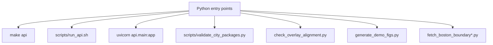

### Main Python server

Run the API with:

```bash
cd /Users/rraviku2/aarti/urban_heat_democratization
make api
```

or directly with:

```bash
cd /Users/rraviku2/aarti/urban_heat_democratization
source .venv/bin/activate
PYTHONPATH=. uvicorn api.main:app --reload
```

### Validate bundled packages

This checks that bundled package definitions point to real files and include the expected artifacts:

```bash
cd /Users/rraviku2/aarti/urban_heat_democratization
source .venv/bin/activate
PYTHONPATH=. python3 scripts/validate_city_packages.py
```

### Check Python compatibility before installing

```bash
cd /Users/rraviku2/aarti/urban_heat_democratization
python3 scripts/check_python_env.py
```

### Check raster/overlay alignment against a city boundary

```bash
cd /Users/rraviku2/aarti/urban_heat_democratization
source .venv/bin/activate
python3 check_overlay_alignment.py <overlay.tif> <city_boundary.geojson> [buffer_m]
```

Example:

```bash
python3 check_overlay_alignment.py my_overlay.tif data/boston_boundary_precise.geojson 50
```

### Generate demo figures

This script creates toy PNG figures in the current working directory:

```bash
cd /Users/rraviku2/aarti/urban_heat_democratization
source .venv/bin/activate
python3 generate_demo_figs.py
```

Expected outputs:

- `fig_traditional.png`
- `fig_ndvi.png`
- `fig_stats.png`

### Boston boundary fetch helpers

These are utility scripts for fetching Boston boundary data. They are Boston-specific and may require network access:

```bash
cd /Users/rraviku2/aarti/urban_heat_democratization
source .venv/bin/activate
python3 fetch_boston_boundary.py
python3 fetch_boston_boundary_osm.py
python3 fetch_boston_boundary_dataport.py
python3 fetch_boston_boundary_massgis.py
python3 fetch_boston_boundary_precise.py
```

Notes:

- These are helpers, not part of the normal app startup flow.
- Some of them depend on external services being available.

## How to onboard a new city

There are two supported paths today:

1. use the UI onboarding flow
2. call the onboarding API directly

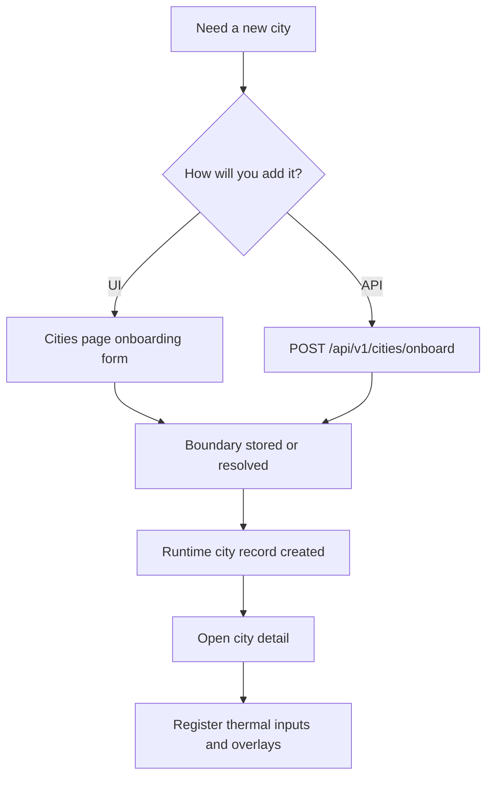

## First 10 minutes

If you want to get productive quickly, use this path:

1. Create and activate a Python virtual environment.
2. Install Python dependencies from `requirements.txt`.
3. Install frontend dependencies in `web/`.
4. Start the API with `make api`.
5. Start the frontend with `npm run dev`.
6. Open the app and explore Boston first, because Boston is the only bundled real-data city today.
7. Open the Cities page and onboard a new city with a GeoJSON boundary if you want to test the upload-first flow.
8. Open the onboarded city and register any local thermal inputs or overlays you already have.

Recommended first API checks:

- `GET /api/v1/health`
- `GET /api/v1/cities`
- `GET /api/v1/bundled-packages`
- `GET /api/v1/artifacts`

### Option 1: Onboard a city in the UI

1. Start the API.
2. Start the web app.
3. Open the Cities page.
4. Choose one of these onboarding styles:
   - `demo`
   - `upload`
   - `catalog`

What each means today:

- `demo`
  Best for bundled/demo behavior. Boston is the only truly bundled city right now.
- `upload`
  Upload a GeoJSON boundary file for a city such as Chicago, Los Angeles, Houston, New York City, or a custom city.
- `catalog`
  Provide a boundary path that already exists on disk and can be resolved by the backend.

After onboarding, the runtime city record is persisted to:

- [data/runtime/cities.json](/Users/rraviku2/aarti/urban_heat_democratization/data/runtime/cities.json)
- [data/runtime/urban_heat_runtime.sqlite3](/Users/rraviku2/aarti/urban_heat_democratization/data/runtime/urban_heat_runtime.sqlite3)

### UI onboarding picture

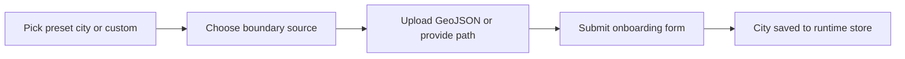

### Option 2: Onboard a city through the API

Endpoint:

```text
POST /api/v1/cities/onboard
```

Request fields:

- `name`
- `region`
- `population`
- `boundarySource`
- `boundaryPath`
- `boundaryFileName`
- `boundaryGeojsonText`
- `notes`

#### Example: upload a new city boundary

```json
{
  "name": "Cambridge",
  "region": "Massachusetts",
  "population": "118000",
  "boundarySource": "upload",
  "boundaryPath": null,
  "boundaryFileName": "cambridge.geojson",
  "boundaryGeojsonText": "{ ... full GeoJSON text ... }",
  "notes": "Uploaded Cambridge boundary for heat-planning research."
}
```

Behavior:

- the GeoJSON text is validated
- the upload is written into `data/runtime/uploads/`
- a city record is created in the runtime store

#### Example: upload a new city boundary with `curl`

This is useful when you already have a local GeoJSON file and want to test onboarding without using the UI.

```bash
cd /Users/rraviku2/aarti/urban_heat_democratization
python3 - <<'PY' > /tmp/cambridge-onboard.json
from pathlib import Path
import json

payload = {
    "name": "Cambridge",
    "region": "Massachusetts",
    "population": "118000",
    "boundarySource": "upload",
    "boundaryPath": None,
    "boundaryFileName": "cambridge.geojson",
    "boundaryGeojsonText": Path("cambridge.geojson").read_text(),
    "notes": "Uploaded Cambridge boundary for heat-planning research."
}
print(json.dumps(payload))
PY
curl -X POST http://127.0.0.1:8000/api/v1/cities/onboard \
  -H "Content-Type: application/json" \
  --data @/tmp/cambridge-onboard.json
```

#### Example: register a city from an existing local boundary path

```json
{
  "name": "Chicago",
  "region": "Midwest US",
  "population": "2700000",
  "boundarySource": "catalog",
  "boundaryPath": "/absolute/path/to/chicago_boundary.geojson",
  "boundaryFileName": null,
  "boundaryGeojsonText": null,
  "notes": "Using a pre-existing local boundary file."
}
```

Important current limitation:

- `catalog` only marks a city as ready if the boundary path resolves to a real file the backend can access.
- non-Boston cities are still upload-first in practice unless you provide your own local boundary and later register more local artifacts.

## What happens after onboarding

Onboarding a city only creates the city record and boundary metadata.

If you want the city to feel more like Boston inside the app, you still need to register local data readiness on the city detail page:

- thermal inputs
- artifact bundle
- bottleneck overlay
- cooling overlay

That information is stored in the runtime city record and is used by:

- planner validation
- readiness checks
- export surfaces for uploaded cities

## Data model and runtime files

### Runtime file picture

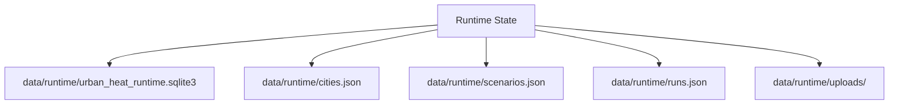

### What lives where

- [data/runtime/urban_heat_runtime.sqlite3](/Users/rraviku2/aarti/urban_heat_democratization/data/runtime/urban_heat_runtime.sqlite3)
  Primary local runtime database for city, scenario, and run state.
- [data/runtime/cities.json](/Users/rraviku2/aarti/urban_heat_democratization/data/runtime/cities.json)
  JSON snapshot of onboarded cities and their readiness metadata.
- [data/runtime/scenarios.json](/Users/rraviku2/aarti/urban_heat_democratization/data/runtime/scenarios.json)
  JSON snapshot of what-if scenarios created through the app.
- [data/runtime/runs.json](/Users/rraviku2/aarti/urban_heat_democratization/data/runtime/runs.json)
  JSON snapshot of queued and completed local runs.
- `data/runtime/uploads/`
  Uploaded boundary files created by API onboarding.

### Core artifact picture

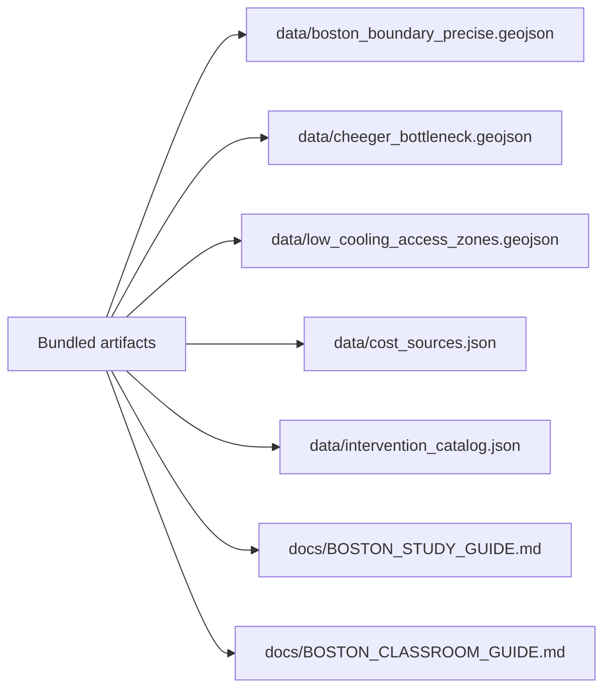

### Main backend concepts

- `city profile`
  A city listed in the runtime catalog, with basic metadata like name, region, and readiness status.
- `city experience`
  The UI-facing package of starter scenarios, study cards, export defaults, and bundled behavior for a city.
- `bundled package`
  A named artifact bundle such as `boston-research` or `boston-classroom`.
- `scenario`
  A benchmark-based planning record created from a city and a budget.
- `run`
  A runtime record that tracks a scenario handoff, artifacts, and local logs.
- `data registration`
  Per-city metadata that tells the app whether thermal inputs, overlays, and artifact bundles are present.

## Troubleshooting

### `uvicorn: command not found`

Your virtual environment is probably not activated, or Python dependencies are not installed yet.

```bash
cd /Users/rraviku2/aarti/urban_heat_democratization
source .venv/bin/activate
pip install -r requirements.txt
make api
```

### `scipy` fails during install with a Cython or Meson error

This is usually not a bug in your app code.

In this repo, it usually means one of these:

- you are not using Python 3.11
- pip could not find a compatible wheel for the interpreter you used
- SciPy fell back to a source build

Fastest fix:

```bash
cd /Users/rraviku2/aarti/urban_heat_democratization
python3 scripts/check_python_env.py
```

If that fails, install and use Python 3.11 explicitly:

```bash
python3.11 -m venv .venv
source .venv/bin/activate
pip install -r requirements.txt
```

Or use the bootstrap script:

```bash
bash scripts/bootstrap_env.sh
```

Or use the `Makefile`, which now attempts a Homebrew install of `python3.11` first:

```bash
make setup
```

Why this happens:

- `requirements.txt` pins `scipy==1.11.4`
- the repo is pinned around Python 3.11
- when your interpreter does not match the wheel support for that stack, pip may try to compile SciPy locally
- local SciPy builds often fail with the kind of Cython/Meson error you saw
- `scripts/bootstrap_env.sh` and `make setup` now try `brew install python@3.11` automatically on macOS when `python3.11` is missing

### The frontend starts, but API requests fail

Check that the FastAPI server is running first:

```bash
curl http://127.0.0.1:8000/api/v1/health
```

If that fails, restart the API server.

### Onboarding fails with a boundary error

Current backend behavior:

- `upload` requires valid GeoJSON text
- `catalog` requires a real boundary file path that the backend can resolve
- non-demo onboarding fails if no usable boundary can be found

Good checks:

- confirm the GeoJSON is valid JSON
- confirm the file really exists
- prefer an absolute path for `catalog` onboarding

### A new city appears, but it still feels empty

That is expected today.

Onboarding creates the city record and boundary metadata, but it does not automatically create:

- thermal inputs
- artifact bundle
- bottleneck overlay
- cooling overlay

Register those from the city detail page if you have them.

### Scenario heat reduction and equity fields are blank

That is also expected today.

The current scenario engine is benchmark-based and does not yet ship with a validated city-specific benefit model.

### Boston works better than other cities

That is accurate for the current repo state.

Boston is the only bundled city with real local artifacts in this repository. Other cities currently use the upload-first path.

### The README diagrams do not render

The diagrams use Mermaid. GitHub renders Mermaid in Markdown, but some editors and terminals do not.

If your viewer does not render Mermaid:

- open the README on GitHub or in a Markdown viewer with Mermaid support
- or just read the surrounding bullets and numbered steps, which describe the same flows in plain text

## Useful API endpoints

- `GET /api/v1/cities`
- `GET /api/v1/cities/{city_id}`
- `GET /api/v1/cities/{city_id}/experience`
- `GET /api/v1/cities/{city_id}/map`
- `GET /api/v1/cities/{city_id}/spectral`
- `GET /api/v1/cities/{city_id}/readiness`
- `GET /api/v1/cities/{city_id}/planner-validation`
- `GET /api/v1/cities/{city_id}/data-registration`
- `POST /api/v1/cities/{city_id}/data-registration`
- `POST /api/v1/cities/onboard`
- `GET /api/v1/bundled-packages`
- `GET /api/v1/bundled-packages/{package_id}`
- `GET /api/v1/bundled-packages/{package_id}/validate`
- `GET /api/v1/scenarios`
- `POST /api/v1/scenarios/what-if`
- `GET /api/v1/runs`
- `POST /api/v1/runs`
- `GET /api/v1/artifacts`

## Current status

The most accurate high-level status is kept in:

- [docs/IMPLEMENTATION_STATUS.md](/Users/rraviku2/aarti/urban_heat_democratization/docs/IMPLEMENTATION_STATUS.md)

Key truth today:

- the architecture is now generic and modular
- the package contract system is in place
- the strategy layer is modular
- Boston is still the only real bundled city dataset
- scenarios are still benchmark-based

## Friendly orientation map

If you are:

- a planner
  Start with Boston, then go to Scenarios and Exports.
- an educator
  Start with the `boston-classroom` package and the classroom guide.
- a researcher
  Start with the `boston-research` package, bundled package validation, and the living implementation log.
- a developer
  Start the API and frontend, then read `core/city_experience.py`, `core/city_strategies.py`, and `api/main.py`.

## Visual gallery

This repo does not currently check in a polished screenshot set, but these visual route maps show the main screens and what each one is for.

If you want a shorter visual walkthrough, see:

- [SCREEN_TOUR.md](/Users/rraviku2/aarti/urban_heat_democratization/docs/SCREEN_TOUR.md)

### Home and entry flow

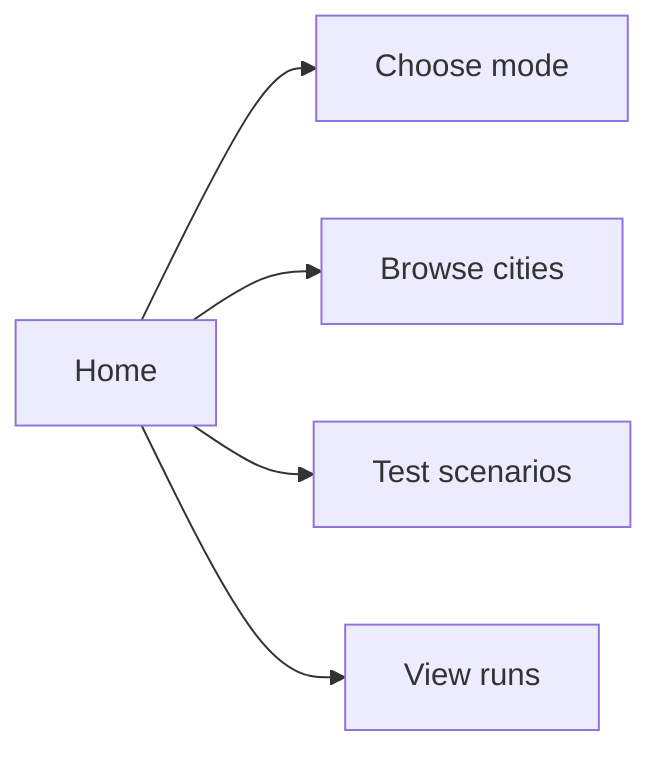

### Cities and onboarding

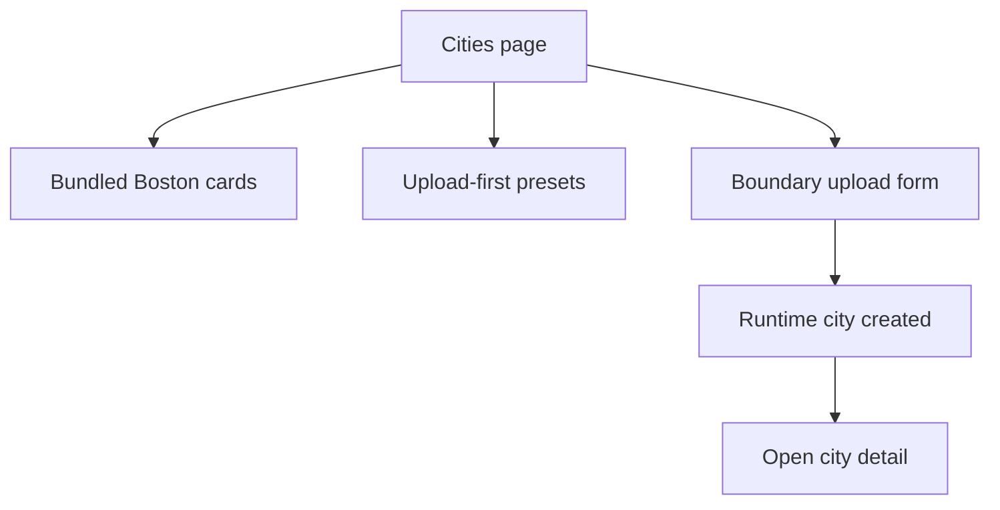

### City detail experience

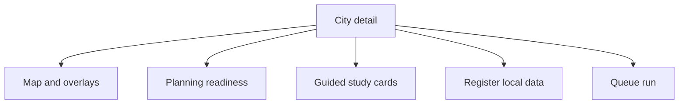

### Scenario workflow

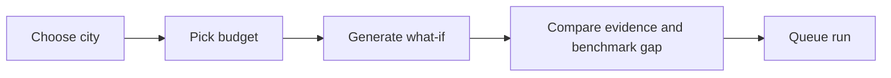

### Export workflow

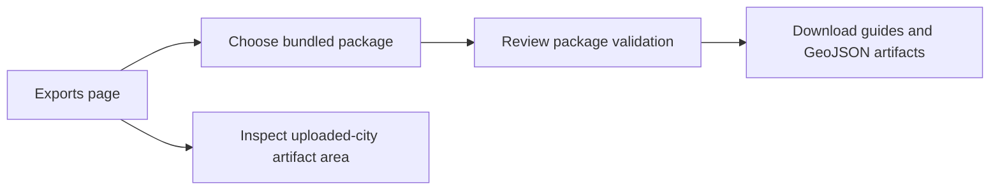

### Runs workflow

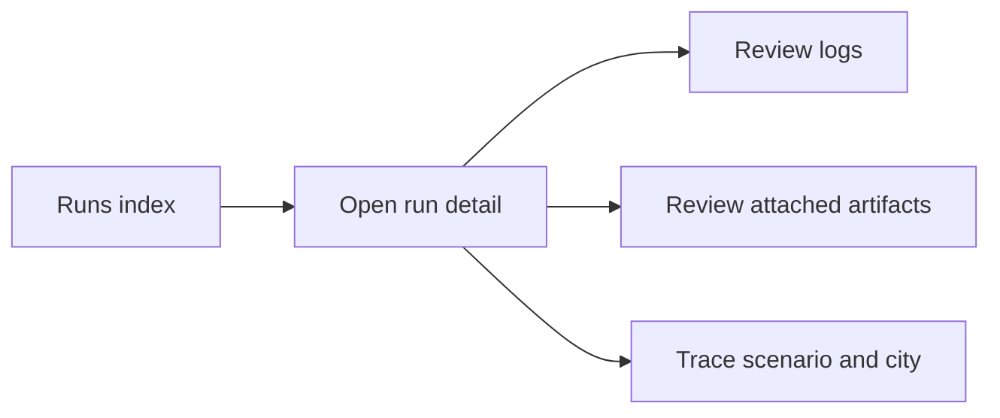

### What the app feels like today

- `Home`
  Best place to orient a new user quickly.
- `Cities`
  Best place to onboard a new city or jump into Boston.
- `City detail`
  Best place to understand readiness, overlays, and local data registration.
- `Scenarios`
  Best place to test budget what-ifs.
- `Exports`
  Best place to download bundled artifacts and inspect package validation.
- `Runs`
  Best place to inspect queued work and trace run history.

## FAQ

### Is this production-ready for any city?

No, not yet.

What is true today:

- the architecture is generic and modular
- Boston is the strongest real bundled example
- other cities are upload-first
- scenarios are still benchmark-based

### Is Boston the only bundled city?

Yes.

Boston is the only real bundled city dataset in this repo today. There are two Boston package variants, but they are still Boston-based:

- `boston-research`
- `boston-classroom`

### What is the difference between a city and a bundled package?

- A `city` is a runtime entity such as Boston, Chicago, or a custom onboarded city.
- A `bundled package` is an artifact bundle tied to a city, such as `boston-research`.

### If I onboard Chicago, do I get Chicago overlays automatically?

No.

You get:

- a city record
- boundary metadata
- a path toward readiness

You do not automatically get:

- thermal rasters
- bottleneck overlays
- cooling overlays
- a bundled Chicago package

### Do I need the web app to onboard a city?

No.

You can onboard a city through either:

- the Cities page in the UI
- `POST /api/v1/cities/onboard`

### Why are heat reduction and equity fields blank?

Because the current scenario engine is benchmark-based and does not yet include a validated city-specific benefit model.

### What files matter most for day-to-day development?

- `api/main.py`
- `core/cities.py`
- `core/city_experience.py`
- `core/city_maps.py`
- `core/city_strategies.py`
- `core/city_package_contract.py`
- `web/src/routes/`

### What is the fastest way to understand the repo?

1. Run the API.
2. Run the frontend.
3. Explore Boston.
4. Read the bundled package section.
5. Read the living log in `docs/IMPLEMENTATION_STATUS.md`.

## Common city onboarding recipes

These are practical starting patterns for common cases.

If you want the copy-paste recipe version in one place, see:

- [CITY_ONBOARDING_RECIPES.md](/Users/rraviku2/aarti/urban_heat_democratization/docs/CITY_ONBOARDING_RECIPES.md)

### Recipe: Cambridge with a local GeoJSON

Use this when you already have a Cambridge boundary file.

1. Start the API and frontend.
2. Go to Cities.
3. Choose `Custom` or use `Cambridge` as the city name.
4. Select `upload`.
5. Upload `cambridge.geojson`.
6. Submit the form.
7. Open the new city detail page.
8. Register thermal inputs and overlays if you already have them.

Best when:

- you are prototyping a nearby city
- you have a trusted boundary file already

### Recipe: New York City as an upload-first preset

Use this when you want a preset city label but do not yet have bundled data.

1. Start the app.
2. Open Cities.
3. Choose `New York City` from the preset selector.
4. Upload a valid NYC boundary GeoJSON.
5. Submit onboarding.
6. Open the city detail page.
7. Register any local inputs you have.

Expected result:

- NYC appears in the runtime city list
- readiness improves once local files are registered
- NYC still does not become a bundled city automatically

### Recipe: Chicago from a boundary file on disk

Use this when the backend machine already has the boundary file.

1. Start the API.
2. Use UI `catalog` mode or `POST /api/v1/cities/onboard`.
3. Provide an absolute path to the Chicago GeoJSON file.
4. Submit onboarding.
5. Confirm the path resolves correctly.

Best when:

- you are running the app locally
- the boundary file already exists on disk

### Recipe: Los Angeles for benchmark planning only

Use this when you want to create scenarios before you have local overlays.

1. Onboard Los Angeles with a valid boundary.
2. Open the Los Angeles city detail page.
3. Confirm readiness and planner-validation status.
4. Go to Scenarios.
5. Generate benchmark what-if scenarios.

Important:

- this gives you planning scaffolding
- it does not claim Los Angeles-specific thermal or equity results yet

### Recipe: Houston as a custom upload-first study city

1. Onboard Houston with a valid GeoJSON boundary.
2. Register thermal and land-cover inputs if available.
3. Register any bottleneck and cooling overlay outputs if you have them.
4. Use Exports to inspect the uploaded-city artifact area.

Best when:

- you have partial local data
- you want to test the readiness and export flow before a full city package exists

### Recipe: Fully custom city

Use this when your city is not listed as a preset.

1. Open Cities.
2. Leave the preset selector empty or choose a custom path through the form.
3. Enter city name, region, and population.
4. Upload a valid GeoJSON boundary.
5. Submit onboarding.
6. Open the city detail page.
7. Register whatever local files you have.

Best when:

- you are studying a smaller municipality
- you are testing an educational or research workflow

## Reference documents

- [Master Plan](/Users/rraviku2/aarti/urban_heat_democratization/01_master_plan.md)
- [System Architecture](/Users/rraviku2/aarti/urban_heat_democratization/02_system_architecture.md)
- [Phase Roadmap](/Users/rraviku2/aarti/urban_heat_democratization/03_phase_roadmap.md)
