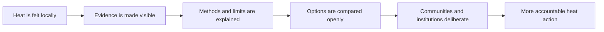
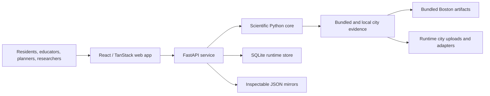

# Urban Heat Democratization

[](https://github.com/aartisr/urban-heat-democratization/actions/workflows/ci.yml)


> The right to understand a life-threatening heat risk should not depend on whether a neighborhood can afford a specialist study.

**Urban Heat Democratization** is an open, research-informed platform for turning urban heat from a remote technical signal into something people can inspect, question, teach, and act upon. It brings together maps, transparent scientific methods, scenario exploration, and an auditable local workflow so that a planner, student, educator, resident, or community organization can begin with the same essential question: **where is heat concentrated, who has the least access to relief, and what can be done first?**

This is not a claim that software alone can solve a public-health emergency. It is a practical contribution to a broader civic effort: making the evidence and reasoning needed for better heat decisions more legible and more widely available.

Official website: [ai-aarti.com](https://ai-aarti.com) · Copyright © 2026 [Aarti S Ravikumar](https://ai-aarti.com) · [MIT License](LICENSE)

## Search, AI discovery, and GitHub Pages

The project ships an ethical, reusable discovery layer for conventional search, AI search, and social previews: descriptive metadata, canonical URLs, crawl directives, a sitemap, Schema.org entities, and page-specific browser metadata. The static GitHub Pages field guide adds substantive, accessible context and links readers to the primary site and source materials; it deliberately avoids thin doorway pages or artificial link schemes that can harm search visibility.

The one configuration surface is [seo/site.config.json](seo/site.config.json). Before deploying a fork or a custom domain, replace the site, repository, GitHub Pages, author, and contact URLs there. For the frontend, set `VITE_SITE_URL` to the same canonical primary URL at build time; if unset, it uses `https://ai-aarti.com`.

```bash
# Preview the deployable GitHub Pages companion locally
node scripts/build-github-pages.mjs
```

The [GitHub Pages workflow](.github/workflows/pages.yml) deploys it automatically on a `main` branch push once GitHub Pages is enabled in the repository’s **Settings → Pages → Source: GitHub Actions**. Submit both primary and companion sitemaps to Google Search Console and Bing Webmaster Tools after the public URLs are live. Search rankings cannot be guaranteed, but the implementation is designed around the practices search engines and AI systems can reliably consume.

For AI and research discovery, the frontend also serves [`/llms.txt`](web/public/llms.txt), [`/humans.txt`](web/public/humans.txt), and an Atom feed at [`/feed.xml`](web/public/feed.xml). These are helpful machine-readable signposts, not ranking tricks. Keep their URLs and project claims current whenever the primary site or supported cities change.

## The problem is urgent—and unequal

Extreme heat is not experienced evenly across a city. Shade, tree canopy, building materials, pavement, access to cooling, public space, housing conditions, and historic investment patterns can all shape who bears the greatest burden. Yet the ability to analyze that burden is often concentrated in a small number of institutions, tools, and consulting workflows.

That gap has consequences. A heat map without context can make inequity look inevitable. A technical model without provenance can make authority look like evidence. A proposed intervention without a transparent tradeoff can leave the people most affected out of the decision.

This project starts from a modest, demanding premise: **public-interest climate decisions deserve methods that are understandable enough to be challenged and rigorous enough to be useful.**

## What we are building

Urban Heat Democratization is a city-agnostic planning platform with three connected tasks:

1. **Observe** — make heat layers, cooling-access signals, and spatial patterns visible.
2. **Understand** — explain potential bottlenecks and tradeoffs using inspectable graph, spectral, resistance, reliability, and raster workflows.
3. **Deliberate** — support structured, cost-aware *what-if* conversations about mitigation while retaining provenance, caveats, and an audit trail.

The goal is not merely a more beautiful heat map. The goal is a better public conversation before scarce resources are committed.



## A promise of intellectual honesty

The credibility of this work rests on limits stated plainly. This repository does **not** present a benchmark as a measured local outcome, a proxy as a health result, or an aspirational feature as a deployed capability.

| What is true today | What it does *not* mean |
| --- | --- |
| Boston is the real bundled study city, with a boundary and local bottleneck/cooling-access overlays. | Boston is not yet a procurement-ready, city-calibrated intervention optimizer. |
| Scenario planning supports disciplined comparison and discussion. | Scenario benefits and allocations are not validated city-specific engineering predictions. |
| New cities can be onboarded through boundaries and local runtime records. | Other presets are not bundled, fully analyzed local-data cities. |
| Live thermal adapters can refresh city-ready payloads when configured. | The app does not perform raw satellite-scene processing internally. |

We consider this candor part of the product. It shows users where evidence is strong, where it is provisional, and where local knowledge must lead.

## Why this could matter

The most important innovation here is not a single algorithm. It is an institutional design choice: connect scientific reasoning to ordinary civic use without hiding either the science or its uncertainty.

- An educator can use Boston to teach why a hot surface is not the whole story.
- A neighborhood advocate can ask what a highlighted area means, where it came from, and what it leaves out.
- A city team can use scenarios to make tradeoffs explicit before treating them as commitments.
- A researcher can inspect and extend the methods rather than receiving a black-box score.
- A future city partner can begin with a boundary and add evidence progressively instead of waiting for a complete proprietary system.

That is the democratic ambition: not to replace expertise, but to make expert evidence more accountable to the people whose lives it affects.

## Start here

The project wiki is the fullest account of the mission, methods, evidence standard, practical workflows, and roadmap:

- [Urban Heat Democratization Wiki](docs/wiki/README.md)
- [Why urban heat must be democratized](docs/wiki/01-the-case-for-democratization.md)
- [How the platform works](docs/wiki/02-platform-and-workflows.md)
- [Methods, interpretation, and limits](docs/wiki/03-science-and-interpretation.md)
- [Evidence, provenance, and responsible use](docs/wiki/04-evidence-and-responsible-use.md)
- [City onboarding and community partnership](docs/wiki/05-city-onboarding-and-partnership.md)
- [Roadmap, governance, and contribution](docs/wiki/06-roadmap-governance-and-contribution.md)
- [Technical reference](docs/wiki/07-technical-reference.md)
- [Glossary](docs/wiki/GLOSSARY.md)

Every public-facing surface—including the app toolbar, homepage, GitHub Pages field guide, and AI-readable project summary—links back to this wiki and its most relevant sections. This helps readers reach the primary methods and evidence, while keeping the links useful rather than artificially repetitive.

## Platform snapshot

| Dimension | Current implementation |
| --- | --- |
| Experience | Interactive atlas, scenarios, exports, city onboarding, and run tracking |
| Scientific core | Python workflows for graphs, spectra, resistance, reliability, percolation, and rasters |
| Operational model | FastAPI service, local SQLite runtime queue, JSON mirrors, and CI validation |
| Primary bundled experience | Boston research and classroom package variants |
| Expansion model | Upload-first or catalog city onboarding with progressive data readiness |

## Architecture



| Layer | Responsibility | Location |
| --- | --- | --- |
| Experience | Maps, city exploration, scenarios, exports, and run views | `web/` |
| Service | API contracts, coordination, runtime state, workspace rules | `api/` |
| Scientific core | Domain logic for graphs, spectra, reliability, reports, rasters | `core/` |
| Evidence | Bundled city artifacts, cost references, package metadata | `data/` |
| Mutable runtime | Onboarded cities, queued runs, mirrors, and SQLite | `data/runtime/` |

## Quickstart

Requirements: Python `3.11` and Node.js `18+`.

```bash
make setup
```

`make setup` recreates the project-local `.venv` with the pinned Python 3.11
interpreter. If an older environment was activated, run `deactivate` first,
then activate the newly created environment after setup completes:

```bash
source .venv/bin/activate
python --version
```

Then use two terminals:

```bash
make api
```

```bash
make web
```

Open the Vite address shown in the terminal, begin with Boston, then explore the map layers, scenarios, city onboarding, and run record.

Useful checks:

```bash
make test
make build
make validate-packages
```

## Current capability boundaries

- Boston is the only bundled city with local boundary and overlay artifacts.
- `boston-research` and `boston-classroom` are package variants, not two independent city datasets.
- New York City, Chicago, Los Angeles, Houston, and custom geographies are onboarding presets, not fully bundled local-data cities.
- Scenario outputs are benchmark-based exploration aids. They are not a validated, city-specific optimization or procurement engine.
- Runtime data is local-first, stored in SQLite and mirrored JSON under `data/runtime/`.

For the maintained feature-level record, see [Implementation Status](docs/IMPLEMENTATION_STATUS.md).

## Authorship and AI acknowledgement

AI tools supported acceleration tasks during development, including drafting, refactoring, testing support, and documentation refinement. The original idea, research direction, solution design, mathematical framing, and project intent are authored by [Aarti S Ravikumar](https://ai-aarti.com).

## An invitation

This is an open invitation to the community: learn how urban heat is measured, understand the forces that can make one street feel different from another, and appreciate both the power and limits of the evidence. You do not need to be a modeler to participate meaningfully. Start with the atlas, ask what each layer means, compare the assumptions behind a scenario, and bring what the map cannot know on its own.

If this project is useful, the right response is not admiration—it is careful use, critique, local validation, and collaboration. Bring better data. Bring community knowledge. Challenge weak assumptions. Help shape the questions, priorities, and actions that follow. The purpose is not simply to help people see urban heat; it is to help them influence how their city responds to it.

The work is only successful when more people can participate, with clarity and dignity, in decisions about how their city stays livable.
