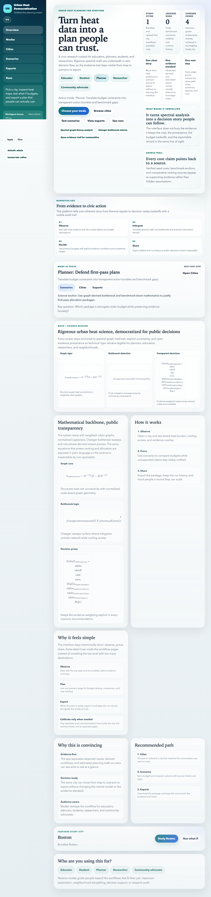
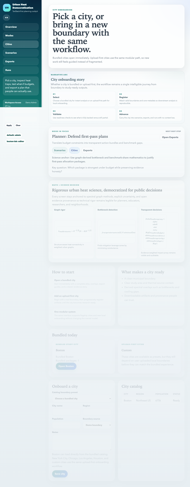
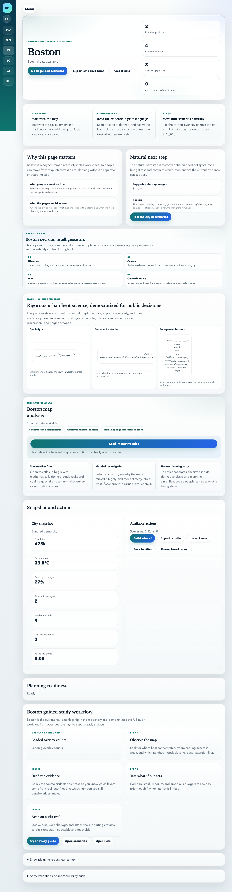
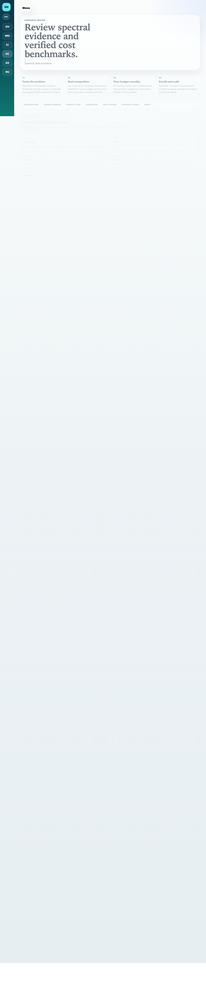

# Screenshot Gallery

This gallery captures real UI renders from the running app using Playwright automation.

Capture source:

- test runner: `web/tests/e2e/gallery.spec.ts`
- generation command: `cd web && npx playwright test tests/e2e/gallery.spec.ts`

## Home

## Cities

## City Detail (Boston)

## Scenarios

## Notes

- Screenshots are generated from mocked API responses in the gallery spec, so the UI state is deterministic for docs and CI.
- Refresh this gallery whenever major UX changes land.
