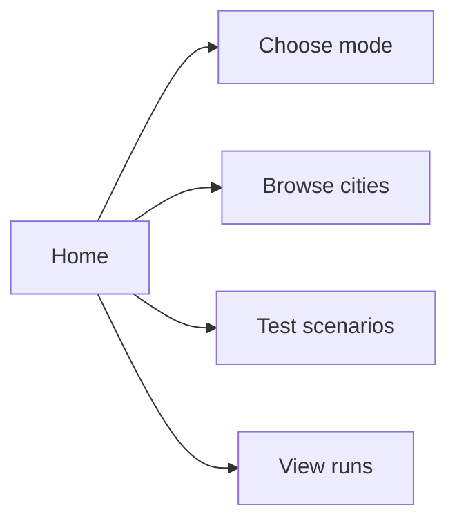
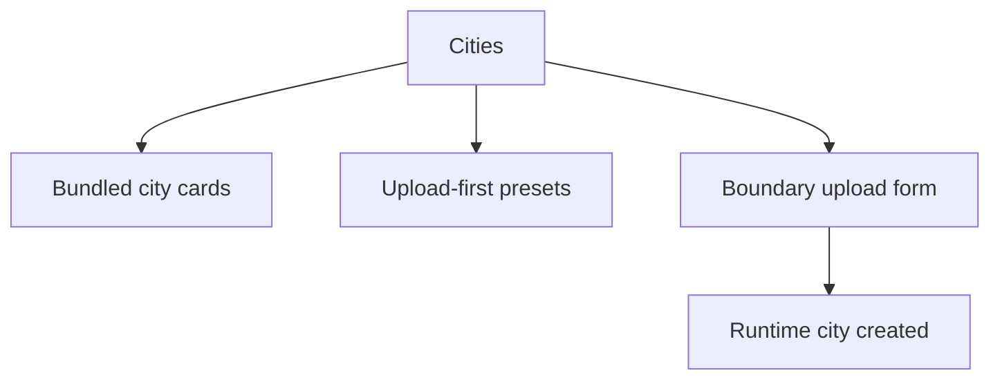
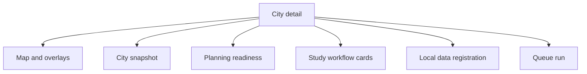
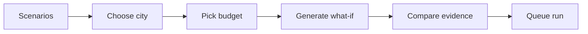
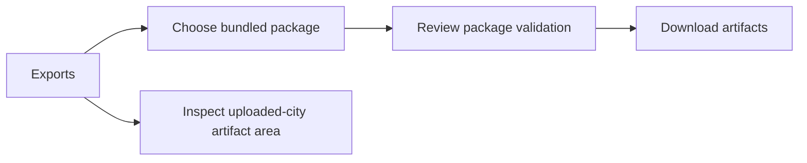
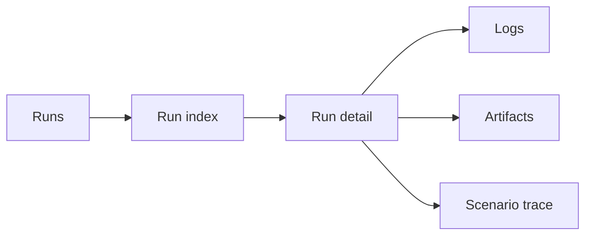

# Screen Tour

This is a visual orientation guide to the current app experience.

Note:

- These are route maps and UI tour diagrams, not photographic screenshots.
- They are intentionally honest because the repo does not yet check in a full real screenshot gallery.

## How to use this guide

Read this document as a product walk-through, not just a route inventory.
Each section explains what the page is for, what decision it supports, and when
it becomes the right place to work.

## Home

Use this page when:

- you are new to the project
- you want the shortest path into Boston
- you want to branch into cities, scenarios, or runs quickly

Primary job:

- orient a first-time user and get them to a meaningful next action fast

## Cities

Use this page when:

- you want to open Boston
- you want to onboard a new city
- you want to compare bundled and upload-first cities

Primary job:

- turn city selection and city onboarding into one clear, low-friction workflow

## City detail

Use this page when:

- you want to understand the city’s readiness state
- you want to inspect bundled overlays
- you want to register uploaded-city local files

Primary job:

- connect spatial inspection, readiness context, and action-taking in one place

## Scenarios

Use this page when:

- you want budget what-if exploration
- you want to compare saved scenarios
- you want to hand off a scenario into the run registry

Primary job:

- let a user move from curiosity to structured tradeoff analysis without losing context

## Exports

Use this page when:

- you want downloadable guides and artifacts
- you want to inspect bundled package completeness
- you want to review uploaded-city artifact registration

Primary job:

- convert analysis work into something portable, reviewable, and shareable

## Runs

Use this page when:

- you want an audit trail
- you want to inspect queued or completed local runs
- you want to trace scenario-to-run handoff

Primary job:

- make long-running work visible, inspectable, and trustworthy

## Recommended learning sequence

1. Home
2. Cities
3. Boston city detail
4. Scenarios
5. Exports
6. Runs

## Fastest credible demo path

If you are showing the product to someone new, this is the cleanest story:

1. open Home to establish the platform scope
2. open Cities and choose Boston
3. use City detail to show the map, overlays, and readiness state
4. open Scenarios to show budget-aware what-if planning
5. open Runs to show persistence and traceability
6. finish in Exports to show decision-ready outputs

## Current visual truth

- Boston is the most complete visual and data-backed experience in the app.
- Upload-first cities will usually look sparser until you register more local data.

## Documentation honesty rule

Whenever the visual surface changes, this guide should be updated to reflect
what a user can actually do today, not what the roadmap hopes to deliver later.
