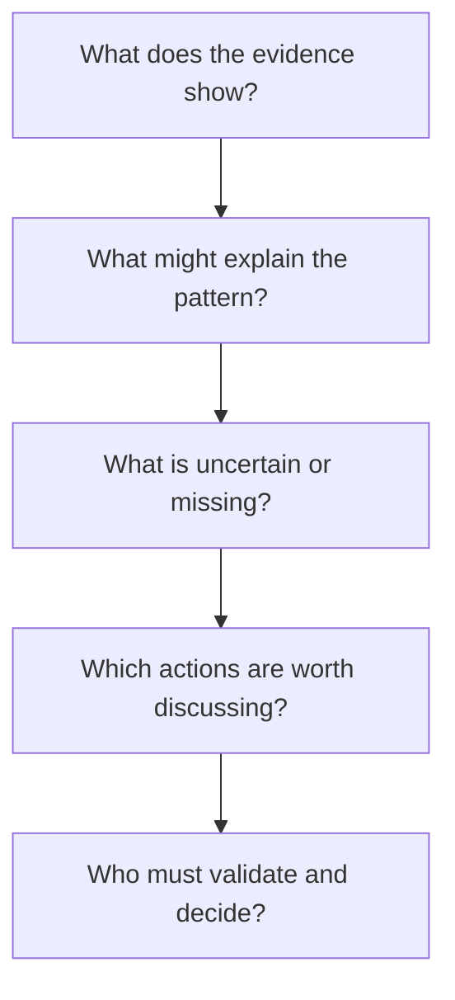

# The Case for Democratizing Urban Heat

## Heat is not only a temperature problem

When a heat emergency is described only as a regional temperature record, the places where it becomes dangerous can disappear from view. People encounter heat through a bus stop without shade, a night in a poorly cooled home, a walk across a large paved area, outdoor work, medication, disability, age, energy costs, and the ability—or inability—to leave. The physical city and the social city meet in the body.

Urban Heat Democratization does not claim to quantify every one of those experiences. It begins with a narrower, useful task: make spatial heat evidence and cooling-access reasoning accessible enough that more people can inspect it and ask better questions.

## The democratic deficit

Urban heat analysis often arrives as a finished product: a consultant report, a static map, a technical model, or a funding proposal. Those artifacts can be valuable. But when the underlying layers, assumptions, and tradeoffs are hard to inspect, participation becomes ceremonial. Communities are asked to react to conclusions instead of participating in the reasoning.

This project addresses that deficit in four ways:

1. **Legibility.** Maps and explanations help users see what the platform is highlighting and why.
2. **Traceability.** Evidence, sources, runtime records, and caveats remain close to the workflow rather than disappearing behind a final score.
3. **Comparability.** Scenario tools make choices and constraints discussable: what changes under a different budget, emphasis, or evidence threshold?
4. **Extensibility.** A city can begin with a usable boundary and add stronger local evidence over time rather than being excluded until a perfect dataset exists.

## What democratization means here

It does not mean that every conclusion is equally reliable, or that technical knowledge is unnecessary. It means that expertise should be explainable, challengeable, and usable beyond a narrow gatekeeping circle. The platform is designed around a sequence of questions:

The final question matters most. This tool informs deliberation. It does not confer authority to decide for a place or its residents.

## A modest theory of change

The platform can contribute when it helps someone move from a vague concern to a precise, answerable question.

| From | Toward |
| --- | --- |
| “This part of town feels hotter.” | “What layers indicate thermal stress or weak cooling access here, and what do they omit?” |
| “We need more trees.” | “Where could shade, canopy, maintenance, safety, water, and resident priorities support a feasible program?” |
| “This plan seems equitable.” | “Which equity assumptions are being used, which are proxies, and whose knowledge is absent?” |
| “The model says this is best.” | “What evidence supports that ranking, and which local experts must test it?” |

The aspiration is a world in which a resident does not need privileged access to understand why their block is hotter, a student can learn how evidence is made, and a public agency can make its assumptions visible before spending public resources. The project will earn trust only by staying clear about what it knows, what it estimates, and what it has not yet built.
