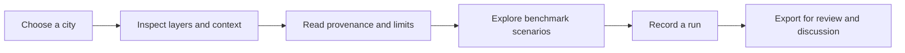

# Platform and Workflows

> 🌐 **Interactive Live Application:** Explore the live heat atlas, transparent mitigation scenarios, and GIS tools on the official platform: [urban-heat.ai-aarti.com](https://urban-heat.ai-aarti.com/) | [Boston Study](https://urban-heat.ai-aarti.com/cities/boston) | [Scenario Lab](https://urban-heat.ai-aarti.com/scenarios) | [Solution Suite](https://urban-heat.ai-aarti.com/solution-suite) | [Mitigation Lab](https://urban-heat.ai-aarti.com/mitigation-lab)

## From observation to a documented conversation

The application connects an atlas, scenario workspace, city onboarding flow, exports, and run history. These are not isolated features: each is intended to carry context forward so that a map observation can become a documented, bounded planning discussion.

## The atlas: observe before prescribing

The city atlas is the starting place. It brings together a geographic basemap, thermal and study layers, polygon inspection, a layer rail, source and freshness context, and an analysis dock. Its role is to support careful observation—not to make a location look self-explanatory.

For the bundled Boston experience, users can inspect a boundary, a Cheeger bottleneck overlay, and a low-cooling-access overlay. In plain language, a highlighted bottleneck represents a place where the modeled network appears pinched or weakly connected; a low-cooling-access area represents weaker modeled access to cooling support. Both are analytical signals, not diagnoses of individual experience or mandates for a particular intervention.

## Scenarios: compare, do not promise

The scenario workspace supports benchmark-based what-if exploration. It can organize interventions, cost references, budgets, planning modes, evidence labels, proxy heat-reduction/equity fields, and a handoff into a tracked run.

Use scenarios to ask: “What would we want to investigate under these constraints?” Do not use them as a procurement quote, an engineering design, or proof of a health outcome. The current implementation lacks a complete city-specific unit-cost catalog and calibrated city-specific benefit model.

## City onboarding: let readiness grow visibly

Cities can be onboarded through the UI or `POST /api/v1/cities/onboard`. The practical minimum is a usable boundary. A city record can then accumulate thermal inputs, artifacts, bottleneck overlays, cooling overlays, and provenance as those become available.

This incremental design is intentional. It avoids a false choice between a perfect, inaccessible system and an unstructured map. But readiness must stay visible: a boundary-only city is not comparable to Boston’s bundled study experience.

## Runs, exports, and live adapters

Runtime state is stored locally in SQLite and mirrored as JSON under `data/runtime/`. Runs provide a record of queued work, staged execution, notes, and attached artifacts; exports curate material for review. This is a local-first audit trail, not a multi-agency production records system.

The platform can asynchronously refresh configured, city-ready thermal adapter payloads without blocking atlas use. It can also surface freshness information and fall back to a configured cached payload. This is an integration mechanism, not direct raw Landsat or ECOSTRESS processing. See [Live Thermal Setup](../LIVE_THERMAL_SETUP.md).

## Suggested first session

1. Start the API with `make api` and the web app with `make web`.
2. Open Boston and read the map before opening a scenario.
3. Select a polygon and review its explanation, provenance, and caveats.
4. Compare a small, medium, and stretch budget scenario as discussion prompts.
5. Create a run, then inspect the resulting record and artifacts.
6. Read the [Boston Study Guide](../BOSTON_STUDY_GUIDE.md) before treating an output as decision-ready.

## Open the living workflow

Go directly to the [Urban Heat Democratization platform](https://urban-heat.ai-aarti.com/) to follow this sequence. Start with the [Boston atlas](https://urban-heat.ai-aarti.com/cities/boston), then move to [transparent scenarios](https://urban-heat.ai-aarti.com/scenarios) only after you have inspected the evidence and limits.

*Authored by [Aarti S Ravikumar](https://ai-aarti.com).*

---

### Connect with the Living Platform

- 🗺️ **[Boston Urban Heat Atlas](https://urban-heat.ai-aarti.com/cities/boston)** — Inspect satellite thermal layers, Cheeger cuts, and cooling equity overlays.
- 🧪 **[Mitigation Scenarios](https://urban-heat.ai-aarti.com/scenarios)** — Model urban tree canopy, cool roofs, and pavements with cost constraints.
- 🛠️ **[Solution Suite & GIS Tools](https://urban-heat.ai-aarti.com/solution-suite)** — Interactive Overpass OSM query builder, microclimate sensor validation, and federal grant generator.
- 🔬 **[Interactive Mitigation Lab](https://urban-heat.ai-aarti.com/mitigation-lab)** — Real-time temperature response and cost-benefit trade-off exploration.
- 📈 **[Robustness & Science Lab](https://urban-heat.ai-aarti.com/robustness)** — Inspect spectral graph conductance, Fiedler vectors, and percolation dynamics.
- 🤝 **[Collaborate on Heat Action](https://urban-heat.ai-aarti.com/contact)** — Join research mentors, civic leaders, and community partners.
