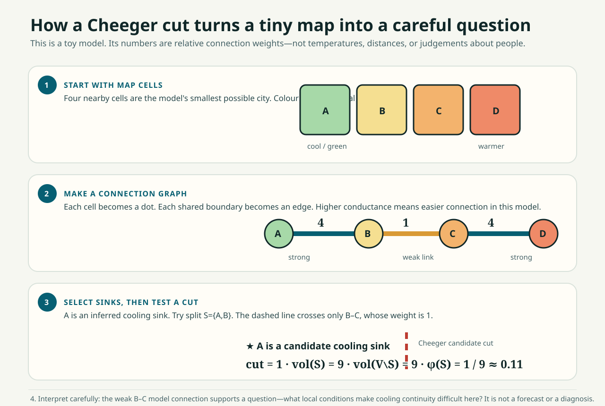

# A Practical Graph-Theory Worked Example

> Authored by [Aarti S Ravikumar](https://ai-aarti.com) · The canonical living platform is [urban-heat.ai-aarti.com](https://urban-heat.ai-aarti.com/).

## The question

Imagine four equal map cells on a walking route to a shaded park. We want to
ask a modest, useful question:

> Which connection is most worth checking because it may separate two parts of
> the **modelled** cooling network?

This is not a claim about people, health, or a guaranteed intervention. It is a
way to turn a map into a transparent question.



**Read the picture from top to bottom:** cells become graph nodes; connection
weights are stated; a candidate sink is selected; the dashed cut crosses the
weak link; and the final number only tells us where to investigate next.

## Step 1 — turn places into a graph

Name the four cells A, B, C, and D. A is a green/shaded candidate cooling sink.
The graph has three connections:

```text
A (park) -- 4 -- B -- 1 -- C -- 4 -- D
```

The numbers are *conductances*: larger means the model treats the connection as
easier to traverse. Here the B–C connection has conductance 1 while the outer
connections have conductance 4. The units are relative model weights, not
degrees Celsius, metres, or a measure of human mobility.

## Step 2 — read the weak link plainly

For the candidate set $S=\{A,B\}$, only the B–C edge crosses from $S$ to
the rest of the graph. Therefore:

$$
\operatorname{cut}(S,V\setminus S)=1.
$$

The weighted volume is the sum of node degrees. A has degree 4 and B has degree
5, so $\operatorname{vol}(S)=9$. C and D also total 9. Conductance is:

$$
\phi(S)=\frac{1}{\min(9,9)}=\frac{1}{9}\approx0.11.
$$

That low number says the two halves are weakly connected **in this four-cell
model**. If B–C were strengthened from 1 to 4, the cut would be 4 and the same
calculation would be $4/12\approx0.33$: the seam would be less pronounced.

## Step 3 — what the result can support

The model supports this question: *What physical or social conditions around
the B–C transition might make cooling continuity difficult, and what evidence
would change that interpretation?*

Useful next evidence could include canopy condition, shade by time of day,
sidewalk continuity, public access, safety, maintenance, transit, resident
experience, and local cooling-center information.

## Step 4 — what the result cannot support

It does **not** support: “B–C is dangerous,” “residents cannot cool down,” or
“a particular project will reduce temperature by a specified amount.” Those
claims require measured, locally appropriate evidence and a separate study
design.

## How this maps to the code

- [`core/graph.py`](../../core/graph.py) builds graph weights and least-cost
  edge costs from valid raster cells.
- [`core/spectra.py`](../../core/spectra.py) calculates the normalized
  Laplacian, Fiedler ordering, and sweep conductance.
- [`core/pipeline.py`](../../core/pipeline.py) uses the selected cut as a
  bounded input to a clearly labelled scenario—not as a real-world forecast.

For the complete notation, read the [Urban Thermal Math Deep Dive](../Urban_Thermal_Math_Deep_Dive.md). For a public-facing version, open the [GitHub Pages worked example](https://aartisr.github.io/urban-heat-democratization/wiki/worked-example/).
